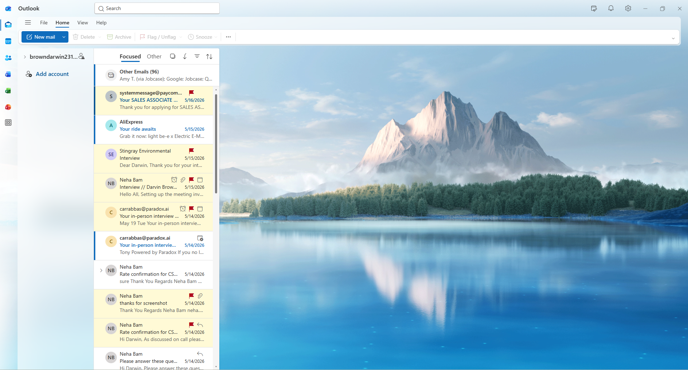
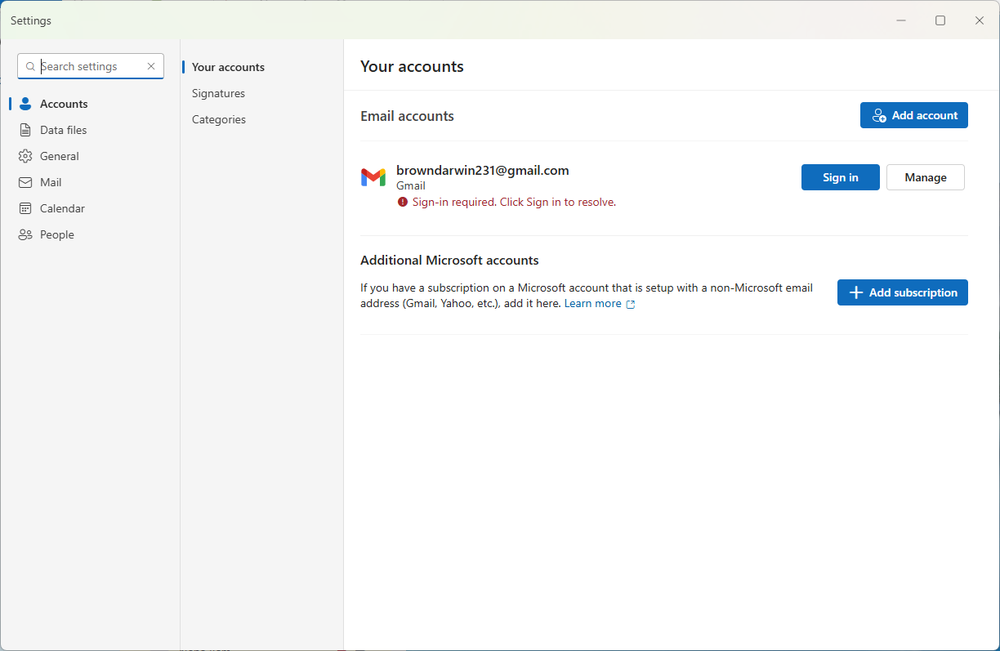
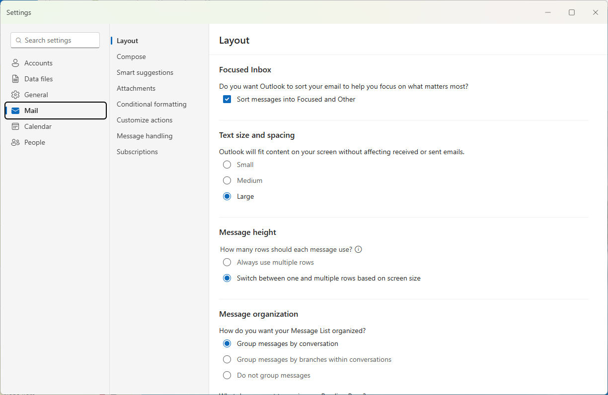
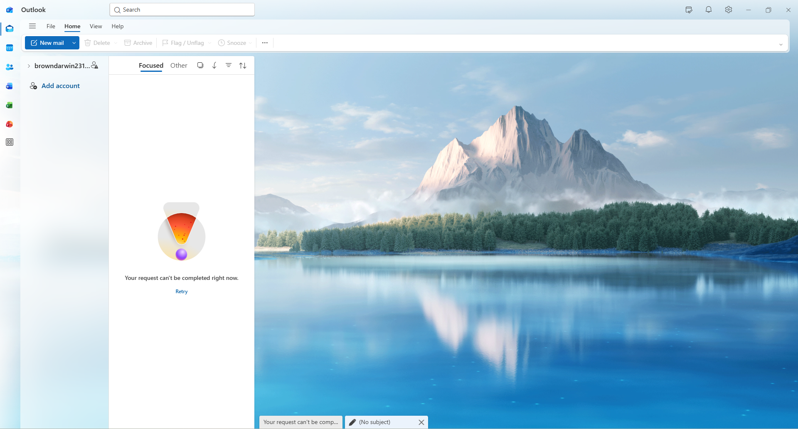
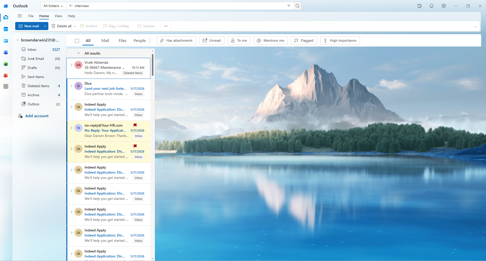
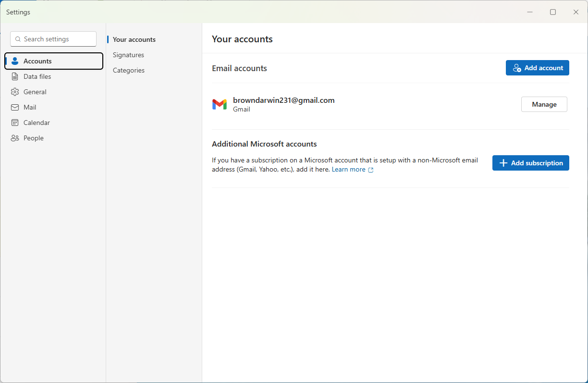
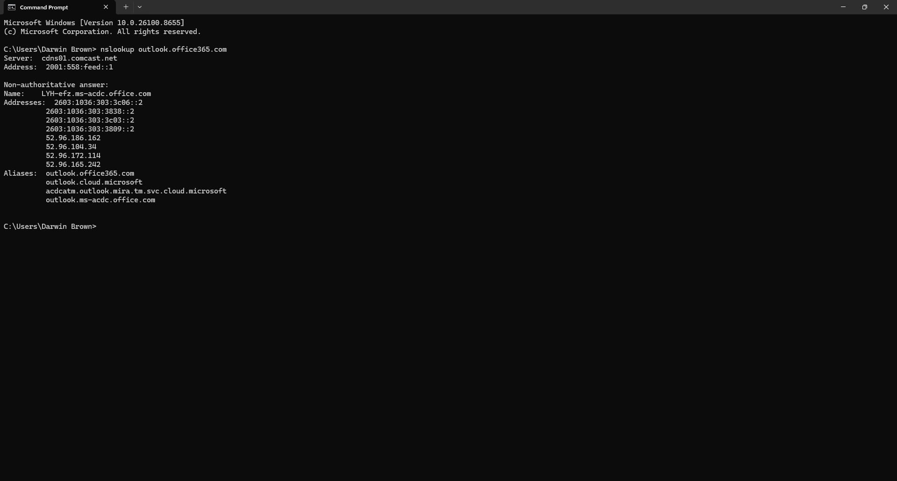
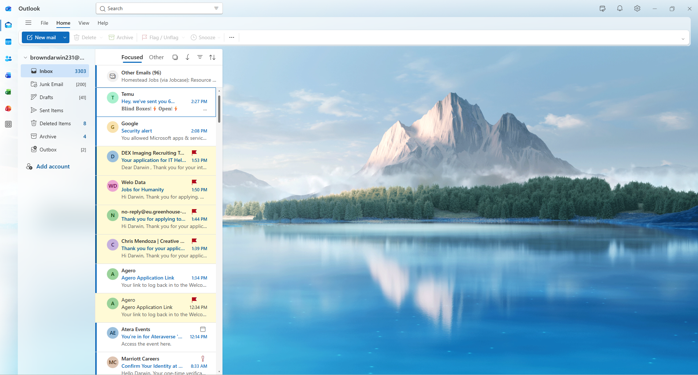

# Darwin Outlook Troubleshooting Lab

## Overview

This project demonstrates common Microsoft Outlook troubleshooting tasks performed by Help Desk and IT Support professionals on Windows 11.

The lab covers Outlook account verification, Windows Mail settings, Outlook error verification, email search testing, account status verification, troubleshooting documentation, and successful Outlook functionality.

---

## Skills Demonstrated

- Microsoft Outlook troubleshooting
- Windows 11 administration
- Email account verification
- Outlook Settings navigation
- Windows Mail configuration
- Outlook error diagnosis
- Email search
- Account verification
- Help Desk troubleshooting methodology
- Technical documentation

---

## Tools Used

- Microsoft Outlook
- Windows 11
- Windows Settings
- Command Prompt
- nslookup
- DNS

---

## Lab Walkthrough

### 1. Outlook Home Screen

Verified Microsoft Outlook launched successfully and confirmed the application environment before beginning troubleshooting.

---

### 2. Account Settings

Verified the configured Gmail account and confirmed the account was successfully connected.

---

### 3. Outlook Mail Settings

Reviewed Outlook Mail settings and verified account configuration.

---

### 4. Outlook Error

Verified Outlook reported an account issue during troubleshooting before corrective actions were completed.

---

### 5. Search Email

Confirmed Outlook search functionality by locating emails using the built-in search feature.

---

### 6. Account Status

Verified the Outlook account was functioning correctly after troubleshooting.

---

### 7. Troubleshooting Summary

Reviewed the completed troubleshooting process and confirmed all verification steps were successfully completed.

---

### 8. Project Working

Confirmed Microsoft Outlook was functioning correctly after troubleshooting by successfully accessing the Inbox and receiving emails.

---

## Troubleshooting Workflow

1. Launch Microsoft Outlook.
2. Verify the configured email account.
3. Review Outlook Mail settings.
4. Diagnose Outlook account issues.
5. Verify Outlook search functionality.
6. Confirm account status.
7. Review troubleshooting results.
8. Verify successful Inbox synchronization.

---

## Outcome

Successfully verified Microsoft Outlook configuration, account connectivity, email search functionality, account status, and Inbox synchronization using standard Windows Help Desk troubleshooting procedures.
